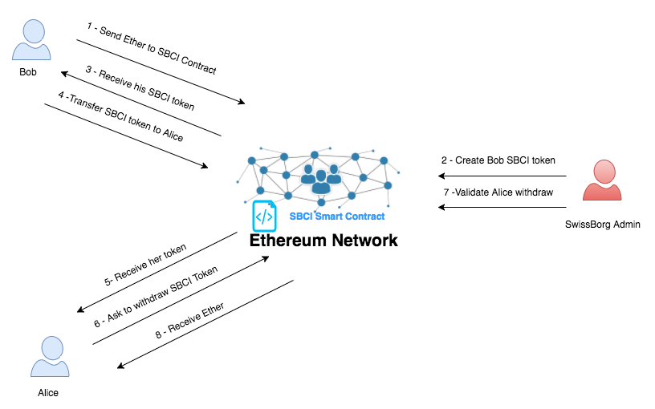

# SwissBorg Cyborg Index (SBCI Token)

version : 0.2

[](https://www.swissborg.com/)


## Introduction

This package contains Ethereum Solidity smart contracts to manage SwissBorg cyborg Index token.
It can be use to create, transfer, redeem SBCI token, this token implements the core [ERC20](https://github.com/ethereum/EIPs/issues/20) standard functionality.

## Interacting with SBCI smart contract

You can interact with SBCI smart contract using :
1. MyEtherWallet
2. Parity
3. Metamask
4. Mist
5. IMTOKEN

**DO NOT USE AN EXCHANGE WALLET**

#### Rinbeky demo of the SBCI smart contract can be access : [https://rinkeby.etherscan.io/token-search](https://rinkeby.etherscan.io/token-search)
* **Smart contract address :**  0xe72cbdff0ed70899c6e33ccf921b8506dcedc965
* **ABI :** [Rinbeky](doc/Rinbeky-ABI.txt)

#### Production ready SBCI smart contract can be access : *(soon)*
* **smart contract address :**  *(soon)*
* **ABI :** *(soon)*

## SwissBorg smart contract Workflow



1. Bob wants to buy SBCI token , he sends Ether to SBCI smart contract 
2. SwissBorg admin checks Bob KYC, updates the token price and creates SBCI token for Bob
3. Bob receives his SBCI token
4. Bob wants to sell SBCI token to Alice (all ERC20 functions are implemented , so Bob can use transfer, allowance, approve ....) , Bob transfers SBCI token to Alice
5. Alice receives her SBCI token
6. Alice sells her token and gets her dividend from Swissborg by asking for withdraw
7. Swissborg admin checks Alice KYC, updates the token price and validates the withdraw
8. Alice receives her Ether

## SBCI smart contract functions
1.  **name :** name of the smart contract
2.  **totalSupply :** total supply of SBCI token
3.  **version :** version of SBCI smart contract
4.  **owner :** SwissBorg admin address
5.  **symbol :** token symbol
6.  **tokenCap :** maximum SBCI token allowed
7.  **balanceOf :** get SBCI balance of an address (Bob ckecks his SBCI balance)
8.  **getPrice :** get the last quotation of SBCI in Ether (last admin quotation update, not real time price)
9.  **setPrice :** update the token price - *only SwissBorg admin*
10. **createToken :** update token ledger by allocating new tokens to a specific address - *only SwissBorg admin*
11. **transfer :** update token ledger by transferring existing tokens from an address to another (Bob transfers 10 SBCI to Alice)
12. **approve :** give to an address the right to spend a predefined amount of SBCI tokens on behalf of another address (Bob allows Alice to transfer his SBCI to Kevin)
13. **allowance :** give the amount of predefined SBCI Tokens one address is allowed to spend on behalf of another adress (Alice checks SBCI amount she can spend on behalf of Bob)
14. **transferFrom :** transfer SBCI amount from an address to another address ( Alice transfers SBCI from Bob account to Kevin account)
15. **withdrawRequest :** request to exchange SBCI Tokens against ETH at the rate of the next price update (Kevin asks to withdraw an amount of his SBCI)
16. **validateWithdraw :** validate SBCI withdraw from an address (SwissBorg admin validates Kevin withdraw and send corresponding Ether to kevin address) - *only SwissBorg admin*
17. **depositFund :** send Ether to the contract , user can also send the ether directly to the contract without using this function
18. **allocateFund :** send Ether to the contract without creating SBCI token - *only SwissBorg admin*
19. **withdrawFund :** withdraw Ether from the contract - *only SwissBorg admin*
20. **transferOwnership :** transfer Contract administration to another address - *only SwissBorg admin*

## Development

#### Install [Testrpc](https://github.com/ethereumjs/testrpc)
```
$ npm install -g ethereumjs-testrpc
```
#### Install [Truffle](http://truffleframework.com/):
```
$ npm install -g truffle 
```
#### Clone SwissBorg smart contract project
```
$ git clone  https://github.com/SwissBorg/sbci.git 
```
#### Run testrpc
The command below run tesrpc and initiliaze 4 accounts with some Ether and unlock these accounts.

**REMEMBER TO CHANGE PRIVATE KEYS WITH YOURS**

```
$  testrpc --account="0x86f4axxxxxxxxxxxPRIVATEKEYxxxxxxxxxxxxxxxxxxxxxf16920325d4c2b78df39,50000000000000000000" --account="0x44024aa38fbbd25xxxxxxxxxxxxPRIVATEKEYxxxxxxxxxxxxxxxxxxxxx13ebaadcbcd64,100000000000000000000"  --account="0xc84ced8ebbb0eefxxxxxxxxxxxxPRIVATEKEYxxxxxxxxxxxxxxxxxxxxx033157d5c6ecad,0" --account="0x39205bb99f283872ddxxxxxxxxxxxxPRIVATEKEYxxxxxxxxxxxxxxxxxxxxx5da5184ca,1000000000000000000000" –-secure –u 0 –u 1 –u 2 –u 3
```
Stop testrpc with : CTRL + C

#### Compile the smart contracts
* **Move to the directory project sbci**
```
$ cd sbci
```
* **Compile the project**
*DON'T FORGET TO CHANGE THE ADMIN ADDRESS in Owner.sol*
```
$ truffle compile
```

* **Run unit tests** 
Make sure to restart testrpc before each test
```
$ truffle test
```

* **Deploy to development blockchain node (testrpc)**
```
$ truffle migrate
```

* **Interact with the contract on development blockchain (testrpc) with truffle console**
```
$ truffle console
```
Check the balance of account 0
```
> web3.eth.getBalance(web3.eth.accounts[0]).toNumber()
```
Send Ether from account 0 to the smart contract
```
> SwissborgIndex.deployed().then(inst => inst.sendTransaction({ from:web3.eth.accounts[0], value: web3.toWei(1, "ether")})).then(tx => console.log(tx))
```
Get token price
```
> SwissborgIndex.deployed().then( inst => inst.getPrice()).then(result => swissborgindex = result.toString(10))
```

Change token price to 150 **USE YOUR ADMIN ACCOUNT** 
```
> SwissborgIndex.deployed().then( inst => inst.setPrice(150, {from: web3.eth.accounts[3]}))
```
Get new token price
```
> SwissborgIndex.deployed().then( inst => inst.getPrice()).then(result => swissborgindex = result.toString(10))
```

* **Deploy to production/Rinbeky/Kovan blockchain**
*UPDATE THE FILE truffle.js WITH YOUR ETHEREUM NODE ADDRESS*
```
$ truffle migrate --network live
```

## Security and Liability
THE SOFTWARE IS PROVIDED "AS IS", WITHOUT WARRANTY OF ANY KIND, EXPRESS OR IMPLIED, INCLUDING BUT NOT LIMITED TO THE WARRANTIES OF MERCHANTABILITY, FITNESS FOR A PARTICULAR PURPOSE AND NONINFRINGEMENT. IN NO EVENT SHALL THE AUTHORS OR COPYRIGHT HOLDERS BE LIABLE FOR ANY CLAIM, DAMAGES OR OTHER LIABILITY, WHETHER IN AN ACTION OF CONTRACT, TORT OR OTHERWISE, ARISING FROM, OUT OF OR IN CONNECTION WITH THE SOFTWARE OR THE USE OR OTHER DEALINGS IN THE SOFTWARE.

## License
All smart contracts are released under MIT License

## Contributors
* Charles Azanlekor ([azanux](https://github.com/azanux))
